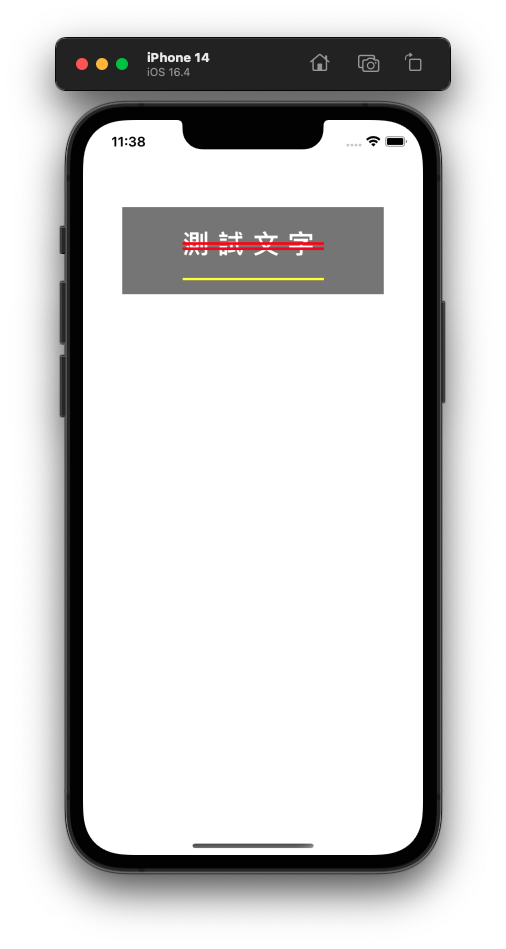

# PDAttributed

簡化Swift 設定NSAttributedString 的步驟

適用於UILabel、UIButton、UITextView、UITextField

***

```
參數

顏色 HEX（字串 ex. "ff0000"）
顏色 RGB（字串 ex. "255/0/0"）

txt, clr        文字／顏色
txt, hex        文字／顏色 HEX
txt, rgb        文字／顏色 RGB
txt, clr, align 文字／顏色 RGB／對齊
txt, hex, align 文字／顏色 HEX／對齊
txt, rgb, align 文字／顏色／對齊
clr, align      顏色／對齊
hex, align      顏色 HEX／對齊
rgb, align      顏色 RGB／對齊

txt          文字
ligature     連體字
font         字體
name, size   字體名稱／尺寸
name         字體名稱
size         字體尺寸     
size, weight 系統字體／尺寸／粗細 
weight       系統字體／粗細
italic       系統斜體／尺寸
clr          字體顏色
hex          字體顏色 HEX
rgb          字體顏色 RGB
bgClr        文字背景
bgHex        文字背景 HEX
bgRgb        文字背景 RGB
charSpacing  字間距
strike       刪除線
strikeClr    刪除線顏色
under        下劃線
underClr     下劃線顏色
strokeW      字邊框寬度
strokeClr    字邊框顏色
offset       Y軸位移
oblique      字傾斜
expand       字延展

align        對齊方向
wrap         斷行方式
lineSpacing  行間距
paraSpacing  段間距
firstIndent  首行縮進
headIndent   頭部縮進
tailIndent   尾部縮進
minH         最低行高
maxH         最高行高
dir          書寫方向
```

***

```swift
// MARK: 簡化前

let vw = UIScreen.main.bounds.size.width;

let label = UILabel(frame: CGRect(x: (vw - 300) / 2, y: 100, width: 300, height: 100));
label.backgroundColor = .gray;
view.addSubview(label);

let style = NSMutableParagraphStyle();
style.alignment = .center;
style.minimumLineHeight = 80

let attributes: [NSAttributedString.Key:Any] = [
    .paragraphStyle: style,
    .kern: 10,
    .font: UIFont.systemFont(ofSize: 30, weight: .bold),
    .foregroundColor: UIColor.white,
    .strikethroughStyle: NSNumber(value: NSUnderlineStyle.double.rawValue),
    .strikethroughColor: UIColor.red,
    .underlineStyle: NSNumber(value: NSUnderlineStyle.single.rawValue),
    .underlineColor: UIColor.yellow,
    .baselineOffset: 30
];
label.attributedText = NSAttributedString(string: "測試文字", attributes: attributes);
```

***

```swift
// MARK: 簡化後

let vw = UIScreen.main.bounds.size.width;

let label = UILabel(frame: CGRect(x: (vw - 300) / 2, y: 100, width: 300, height: 100));
label.backgroundColor = .gray;
view.addSubview(label);

label
    .attr(txt: "測試文字", clr: .white, align: .center)
    .attr(size: 30, weight: .bold)
    .attr(strike: .double)
    .attr(strikeClr: .red)
    .attr(under: .single)
    .attr(underClr: .yellow)
    .attr(charSpacing: 10)
    .attr(minH: 80)
    .attr(offset: 30)
    .end();
```

***



***

Copyright (c) 2023 [Pardn Ltd 帕登國際有限公司](https://joball.tw/@pardnltd)