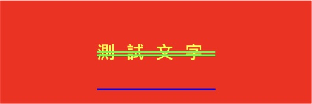

#### 參數

```
txt
ligature     連體字
font         字體
name, size   字體名稱／尺寸
name         字體名稱
size         字體尺寸     
size, weight 系統字體／尺寸／粗細 
weight       系統字體／粗細
italic       系統斜體／尺寸
clr          字體顏色
hex          字體顏色（字串 ex. "ffff00"）
rgb          字體顏色（字串 ex. "255/0/255"）
bgClr        文字背景
bgHex        文字背景（字串 ex. "ffff00"）
bgRgb        文字背景（字串 ex. "ffff00"）
charSpacing  字間距
strike       刪除線
strikeClr    刪除線顏色
under        下劃線
underClr     下劃線顏色
strokeW      字邊框寬度
strokeClr    字邊框顏色
offset       Y軸位移
oblique      字傾斜
expand       字延展

align        對齊方向
wrap         斷行方式
lineSpacing  行間距
paraSpacing  段間距
firstIndent  首行縮進
headIndent   頭部縮進
tailIndent   尾部縮進
minH         最低行高
maxH         最高行高
dir          書寫方向
```

#### 範例


```
// MARK: 簡化前

let label = UILabel(frame: CGRect(x: 0, y: 100, width: 300, height: 100));
label.backgroundColor = .red;

let style = NSMutableParagraphStyle();
style.alignment     = .center;
style.lineBreakMode = .byTruncatingTail;
style.minimumLineHeight = 80

let attributes: [NSAttributedString.Key:Any] = [
    .paragraphStyle 		: style,
    .kern           		: 11,
    .font           		: UIFont.systemFont(ofSize: 17, weight: .bold),
    .foregroundColor		: UIColor.yellow,
    .strikethroughStyle	: NSNumber(value: NSUnderlineStyle.double.rawValue),
    .strikethroughColor	: UIColor.green,
    .underlineStyle			: NSNumber(value: NSUnderlineStyle.single.rawValue),
    .underlineColor			: UIColor.blue,
    .baselineOffset			: 30
];
label.attributedText = NSAttributedString(string: "測試文字", attributes: attributes);
```

```
// MARK: 簡化後
var label = UILabel(frame: CGRect(x: 0, y: 100, width: 300, height: 100));
label.backgroundColor = .red;
label
    .attr(txt: "測試文字", clr: .yellow, align: .center)
    .attr(size: 17, weight: .bold)
    .attr(wrap: .byTruncatingTail)
    .attr(strike: .double)
    .attr(strikeClr: .green)
    .attr(under: .single)
    .attr(underClr: .blue)
    .attr(charSpacing: 11)
    .attr(minH: 80)
    .attr(offset: 30)
    .end();
```